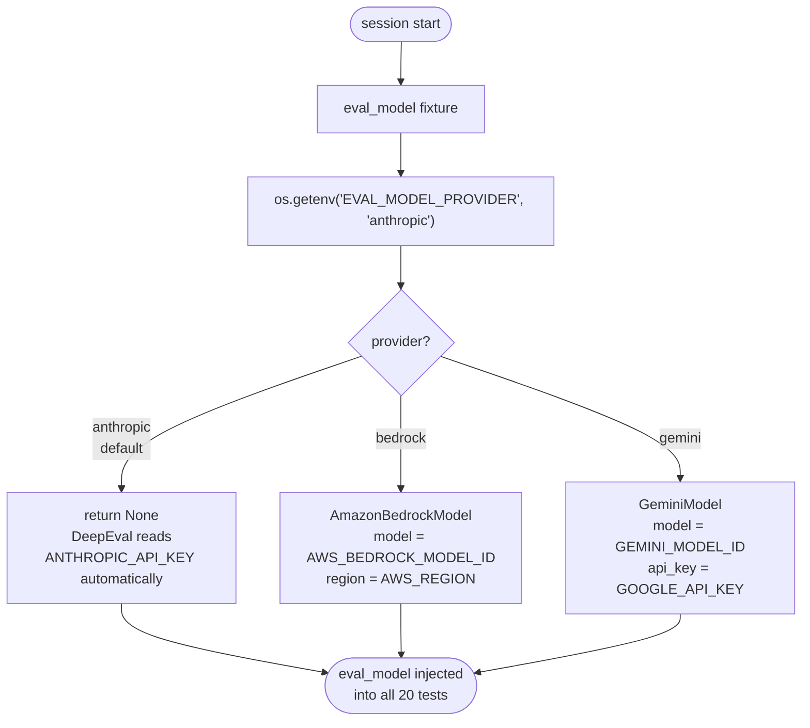
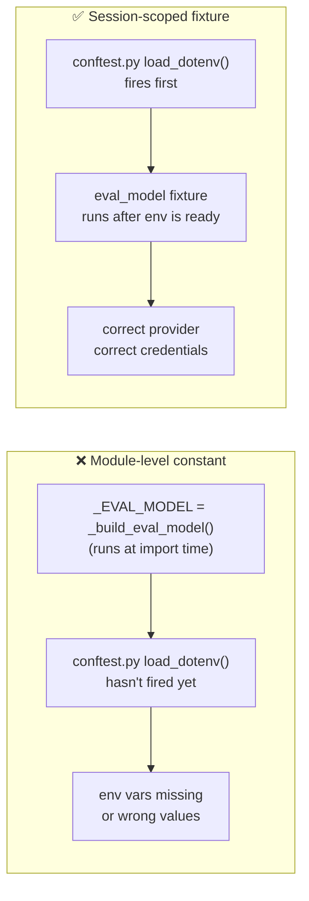

# `eval_model` Fixture

Session-scoped pytest fixture defined in `conftest.py`. Constructs the DeepEval LLM judge once per session and shares it across all 20 parametrized test items.

---

## Construction Flow

---

## Provider Reference

| `EVAL_MODEL_PROVIDER` | Wrapper returned | Required env vars |
|----------------------|-----------------|-------------------|
| `anthropic` (default) | `None` | `ANTHROPIC_API_KEY` |
| `bedrock` | `AmazonBedrockModel` | `AWS_BEDROCK_MODEL_ID`, `AWS_REGION` |
| `gemini` | `GeminiModel` | `GEMINI_MODEL_ID`, `GOOGLE_API_KEY` |

---

## Why a Fixture Instead of a Module-Level Constant?

The fixture is lazy — it only runs when the first test requests it — and it participates in pytest's dependency injection, making it easy to override in tests with a different model.

---

## Related Files

| File | Role |
|------|------|
| `conftest.py` | `eval_model` fixture definition |
| `tests/test_smoke.py` | Consumes `eval_model` via parameter injection |
| `.env` | `EVAL_MODEL_PROVIDER` and model credentials |
