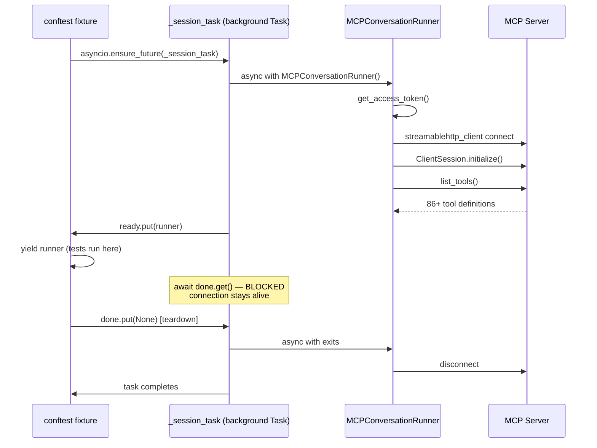
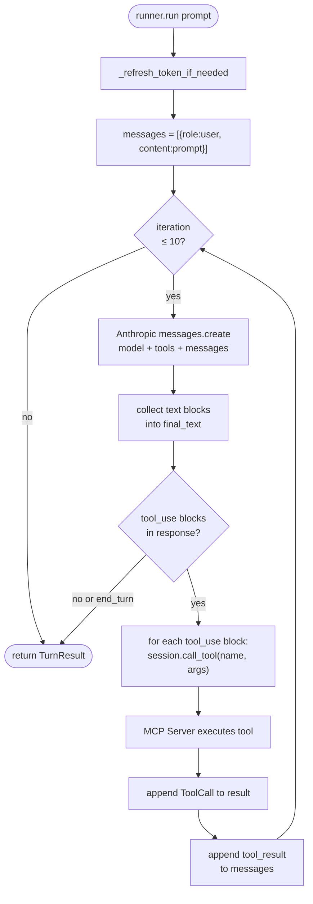
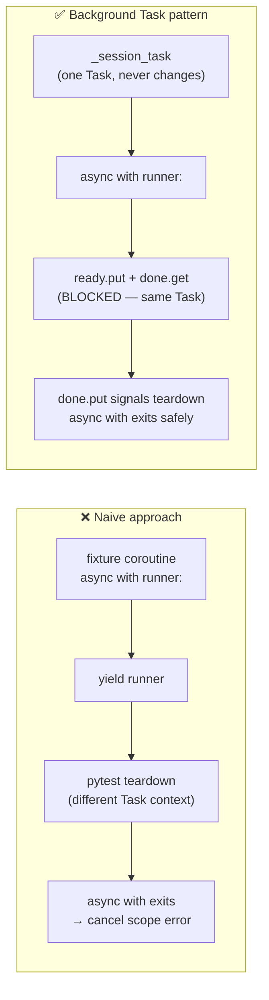
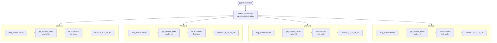

# `mcp_runner` Fixture

Session-scoped pytest fixture defined in `conftest.py`. Opens one MCP connection per pytest session (or per xdist worker), shares it across all tests, and closes it cleanly at teardown.

---

## Session Lifecycle

---

## Agentic Loop (per `run()` call)

---

## Why a Background Task?

`MCPConversationRunner` uses `async with` internally, which creates anyio cancel scopes. A cancel scope must be entered and exited in the **same asyncio Task**.

Error avoided: `Attempted to exit cancel scope in a different task`

---

## Parallel Execution with `-n 4`

| Mode | MCP connections | OAuth/browser calls |
|------|----------------|---------------------|
| `pytest` (sequential) | 1 | 1 (or 0 if cached) |
| `pytest -n 4` | 4 (one per worker) | 0 (controller pre-fetched) |
| `scope="function"` *(not used)* | 20 | up to 20 |

---

## Related Files

| File | Role |
|------|------|
| `conftest.py` | `mcp_runner` fixture definition |
| `conf/runner.py` | `MCPConversationRunner` — connect, agentic loop, refresh |
| `utils/oauth.py` | `MCPOAuthClient` — token fetch and refresh |
