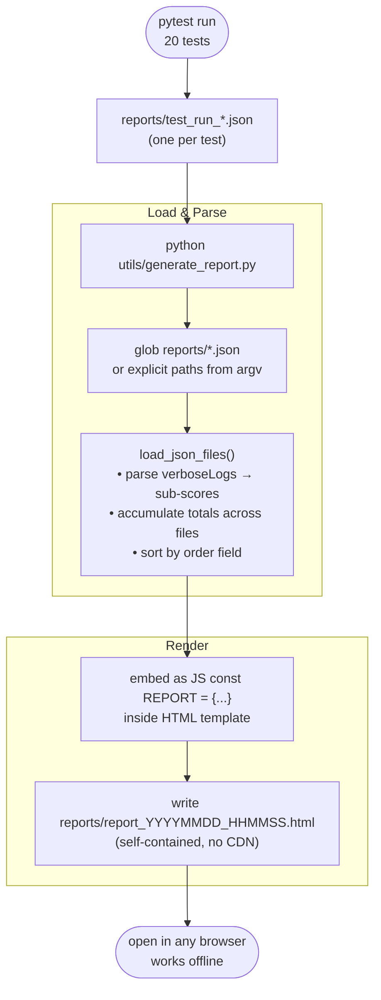
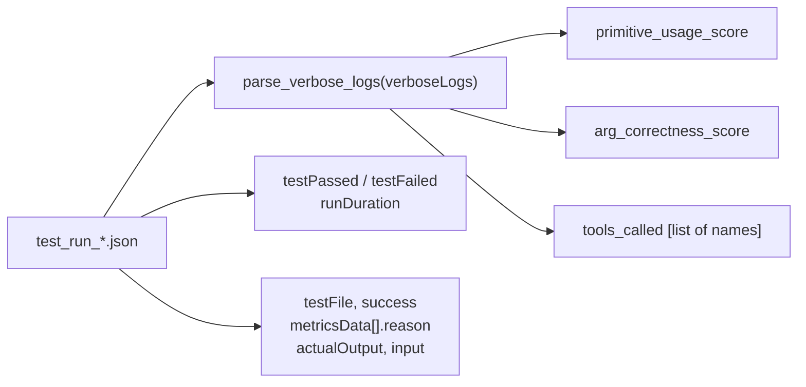
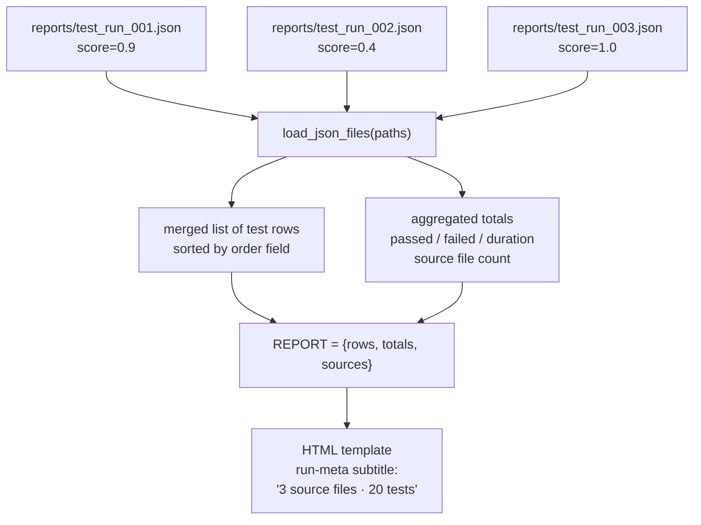
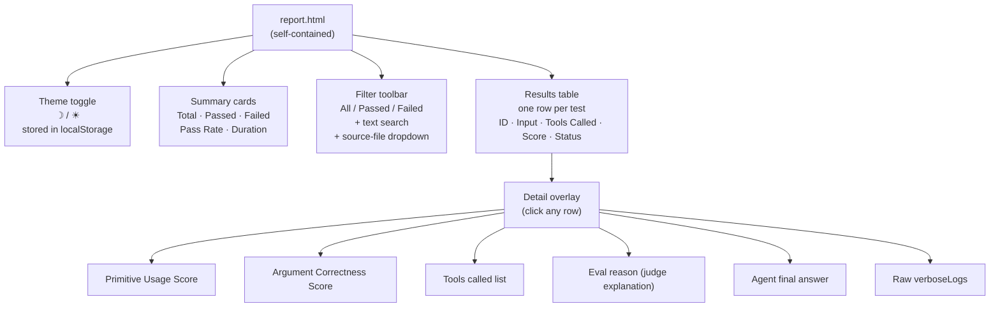
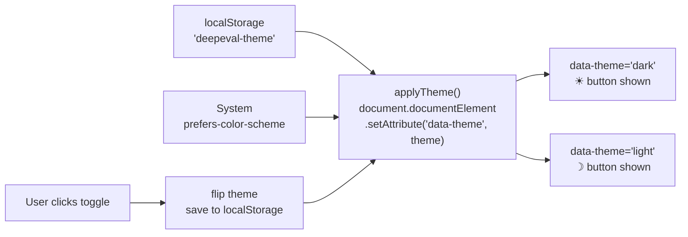

# Report Generation

`generate_report.py` reads one or more DeepEval JSON output files, merges them, and writes a self-contained HTML dashboard to `reports/`.

---

## Pipeline Overview



---

## JSON Parsing — What Gets Extracted



`verboseLogs` is a raw string emitted by DeepEval's MCPUseMetric — the regex extractor pulls the numeric sub-scores and tool names out of it even when the schema changes between versions.

---

## Multi-File Merge



Pass explicit paths for a targeted merge, or omit arguments to merge everything in `reports/`:

```bash
python utils/generate_report.py                          # all reports/*.json
python utils/generate_report.py reports/test_run_01.json # single file
python utils/generate_report.py reports/a.json reports/b.json  # two files
```

---

## HTML Dashboard Structure



---

## Theme System



Priority order: saved localStorage preference → system preference (`prefers-color-scheme: dark`) → light fallback.

---

## Output Files

| File pattern | Created by | Contents |
|---|---|---|
| `reports/test_run_YYYYMMDD_HHMMSS.json` | `evaluate()` in each test | One test result per file |
| `reports/evaluation_YYYYMMDD_HHMMSS.html` | DeepEval `DisplayConfig` | DeepEval's own per-run HTML |
| `reports/report_YYYYMMDD_HHMMSS.html` | `generate_report.py` | **Merged dashboard** — this is the main report |

---

## Related Files

| File | Role |
|------|------|
| `utils/generate_report.py` | Report generator — `parse_verbose_logs()`, `load_json_files()`, HTML template |
| `tests/test_smoke.py` | Writes JSON via `DisplayConfig` after each test |
| `reports/` | Runtime output directory (git-ignored) |
