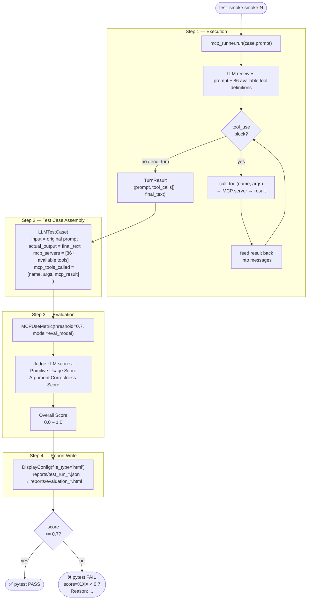
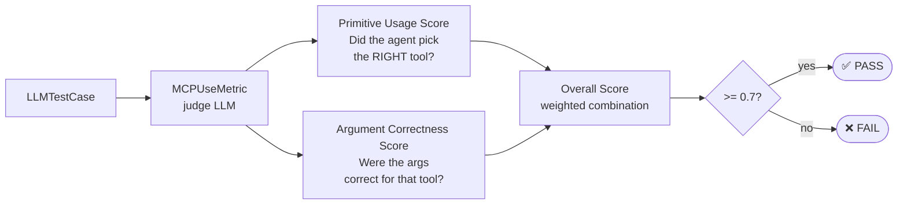
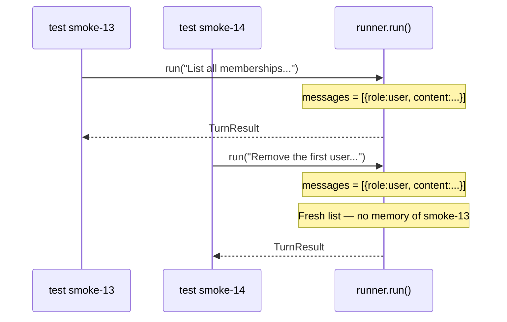
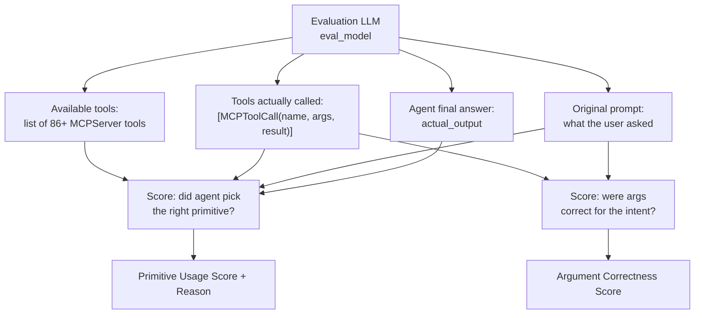

# Single-Turn Test — What Gets Measured

Each parametrized item (`test_smoke[smoke-N]`) is a **single turn**: one prompt in, one agentic loop, one evaluation. No conversation history carries from one test to the next.

---

## Full Test Flow

---

## Score Breakdown

### Score examples

| Scenario | Prim Use | Arg Correct | Overall |
|----------|----------|-------------|---------|
| Right tool, right args | 1.00 | 1.00 | 1.00 |
| Right tool, wrong args | 1.00 | 0.00 | ~0.50 |
| Partial tool match | 0.50 | 1.00 | 0.50 |
| Wrong tool entirely | 0.25 | 0.00 | 0.00 |

Threshold **0.7** means partial credit can still pass — the agent doesn't need to be perfect on every call.

---

## "Single Turn" Explained

Each `run()` call starts with `messages = [{"role": "user", "content": prompt}]`. There is no shared conversation state. `smoke-14` has zero knowledge of what `smoke-13` did — the LLM context is fully isolated per test.

---

## What the Evaluation Judge Sees

---

## Related Files

| File | Role |
|------|------|
| `tests/test_smoke.py` | Parametrized test function |
| `tests/test_cases.py` | `EvalCase` definitions (prompt + expected tool) |
| `conf/runner.py` | Agentic loop — `run()` method |
| `conftest.py` | `mcp_runner` and `eval_model` fixtures |
