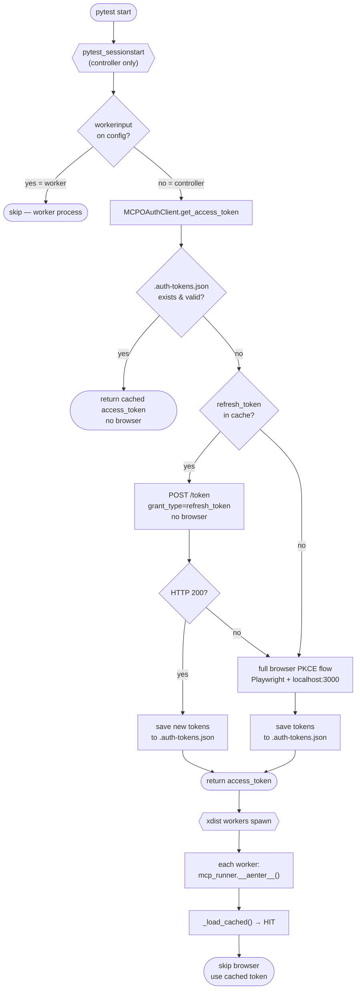
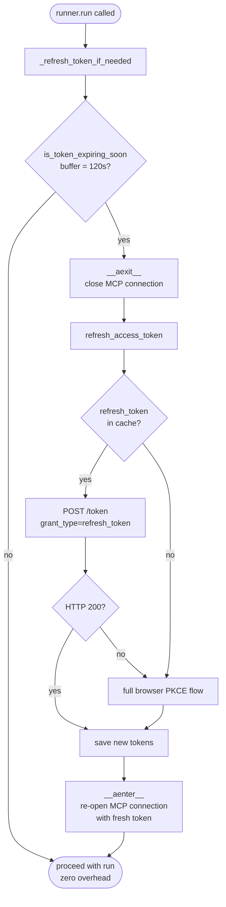

# Token Generation

The suite authenticates with the CloudBees MCP server via OAuth 2.0 Authorization Code + PKCE. A headed browser is only opened when no valid cached token exists. The token is pre-fetched once on the pytest controller before any worker spawns.

---

## Pre-fetch Flow (pytest startup)

---

## Mid-run Token Refresh

Called at the top of every `runner.run()` — proactively reconnects before the token dies.

---

## Token Cache File — `.auth-tokens.json`

| Field | Description |
|-------|-------------|
| `access_token` | Bearer token sent in every MCP request |
| `refresh_token` | Used to get a new access token without a browser |
| `expires_in` | Lifetime in seconds (typically 3600) |
| `issued_at` | Unix timestamp (ms) set when the token was saved |

**Expiry buffers:**

| Buffer | Used in | Meaning |
|--------|---------|---------|
| 60 s | `_load_cached()` | "Is this token usable right now?" |
| 120 s | `is_token_expiring_soon()` | "Should I proactively refresh before the next test?" |

---

## Why the Controller Guard?

`pytest_sessionstart` runs on every process — both the controller and each xdist worker. The guard `not hasattr(session.config, "workerinput")` ensures only the **controller** pre-fetches. xdist sets `workerinput` on worker processes; the controller does not have it.

Without the guard, all 4 workers would race to open the browser simultaneously when no token is cached.

---

## Related files

| File | Role |
|------|------|
| `utils/oauth.py` | `MCPOAuthClient` — PKCE flow, token cache, refresh |
| `conftest.py` | `pytest_sessionstart` hook, `mcp_runner` fixture |
| `.auth-tokens.json` | Runtime token cache (git-ignored) |
